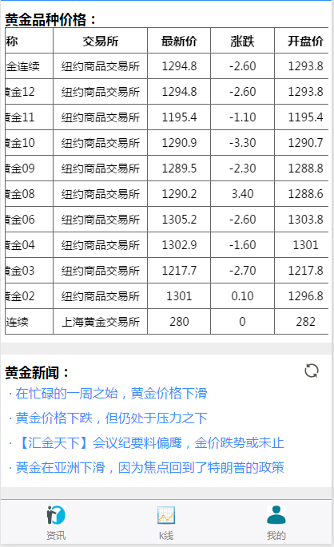
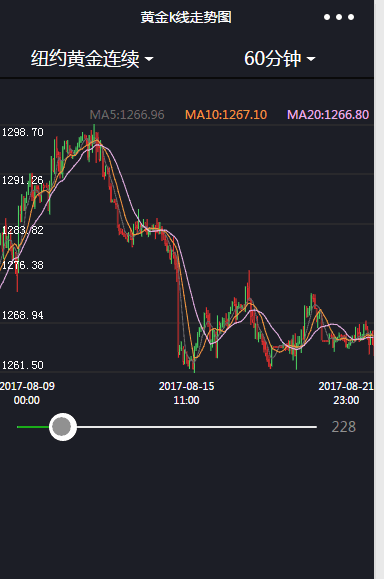

# wechat-weapp-GoldPrice-kline
k线图,chart,e-chart,kline,微信小程序,微信小程序入门,微信小程序学习

## 软件截图：
    
  

## 功能点：
* 轮播图
* 富文本编辑器wxParse的使用
* 可滚动视图区域的使用
* 带参数页面跳转
* k线图
* 用户授权及信息存储
* 等等

## Setup：
下载安装[Wechat DEV Tools](https://mp.weixin.qq.com/debug/wxadoc/dev/devtools/download.html), 并导入[项目](https://github.com/jacksplwxy/wechat-weapp-GoldPrice-kline.git)

### Demo用于学习交流, 转载请注明出处

## 感谢：

k线图是在 https://github.com/Shaman05/wxCharts.git 基础上修改的，感谢作者！
